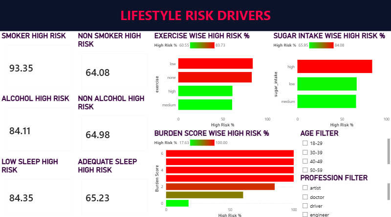
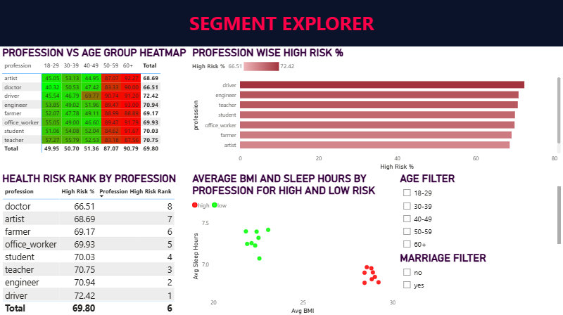

# 🩺 Health Risk Analytics Dashboard

An end-to-end Business Intelligence project that analyzes customer health and lifestyle data to identify high-risk population segments. The project combines **Python**, **MySQL**, and **Power BI** to transform raw health records into actionable business insights for a health insurance company.

---

# 📌 Business Problem

A health insurance company wants to identify demographic and lifestyle patterns associated with elevated health risk in order to design targeted wellness and preventive intervention programs.

The objective of this project is to analyze customer health records, identify high-risk segments, and communicate insights through interactive dashboards and business-oriented analytics.

---

# 🛠 Tech Stack

- **Python**
  - Pandas
  - NumPy
  - Matplotlib
- **MySQL 8.0**
- **Power BI**
- **Jupyter Notebook**

---

# 📊 Dataset

The dataset contains customer-level health and lifestyle information including:

- Age
- Height
- Weight
- BMI
- Exercise Level
- Sleep Duration
- Smoking Status
- Alcohol Consumption
- Sugar Intake
- Marital Status
- Profession
- Health Risk Classification

---

# 📂 Project Workflow

```
Raw CSV
      │
      ▼
Python (EDA & Business Insights)
      │
      ▼
MySQL
(Database Design + SQL Analysis)
      │
      ▼
Power BI
(Interactive Dashboard)
```

---

# 🐍 Part 1 — Python Exploratory Data Analysis

The Jupyter Notebook performs exploratory data analysis to understand customer demographics, lifestyle habits, and health risk distribution.

### Analysis Performed

- Data profiling
- Missing value inspection
- Descriptive statistics
- Health risk distribution
- BMI category analysis
- Age group analysis
- Profession-wise risk analysis
- Lifestyle factor analysis
  - Exercise
  - Sleep
  - Smoking
  - Alcohol
  - Sugar Intake
- Correlation matrix
- Profession × Age heatmap
- Business insights
- Executive recommendations

---

# 🗄 Part 2 — MySQL Database

The raw dataset is first loaded into a staging table before being normalized into relational tables.

## Database Schema

### Customers

Stores demographic information.

Fields include:

- Customer ID
- Age
- Height
- Weight
- BMI
- Marital Status
- Profession

---

### Lifestyle Factors

Stores lifestyle and health information.

Fields include:

- Exercise
- Sleep Hours
- Sugar Intake
- Smoking
- Alcohol
- Health Risk

---

### Staging Table

Used for importing and transforming raw CSV data before normalization.

---

# 📈 SQL Concepts Used

This project demonstrates practical use of:

- Database Normalization
- Foreign Keys
- CTEs (Common Table Expressions)
- Aggregate Functions
- CASE Statements
- GROUP BY
- HAVING
- Joins
- Window Functions
  - RANK()
  - AVG() OVER()
- Business Segmentation
- Risk Scoring

---

# 📊 SQL Analysis

Key business questions answered include:

- Overall high-risk percentage
- High-risk professions
- Health risk by age group
- Average BMI by risk category
- Average sleep duration by risk category
- Lifestyle burden score analysis
- Smoking + low exercise risk comparison
- Profession risk ranking
- Cumulative risk trend across age groups
- Profession × age group risk heatmap
- Highest-risk profession within each age group

---

# 📈 Power BI Dashboard

The project includes a **3-page interactive dashboard**.

---

## 📄 Page 1 — Executive Overview

Provides a high-level summary of customer health.

### KPIs

- Total Customers
- High-Risk Percentage
- Average BMI
- Average Sleep Hours

### Visuals

- Health Risk Distribution
- Health Risk by Age Group
- Interactive Filters


---

## 📄 Page 2 — Lifestyle Risk Drivers

Analyzes how lifestyle habits influence health risk.

### Visuals

- Exercise vs Health Risk
- Smoking vs Health Risk
- Alcohol vs Health Risk
- Sugar Intake vs Health Risk
- Lifestyle Burden Score
- BMI vs Sleep Scatter Plot


---

## 📄 Page 3 — Risk Segment Explorer

Identifies the highest-risk customer segments.

### Visuals

- Profession Risk Ranking
- Profession × Age Heatmap
- Average BMI by Profession
- Interactive Filters


---

# 🔍 Key Insights

Some important findings from the analysis include:

- Approximately 70% of customers were classified as high risk.
- Smoking and low levels of physical activity were associated with significantly higher health risk.
- Customers with higher BMI generally exhibited greater health risk.
- Average sleep duration was lower among high-risk customers.
- Certain professions consistently showed higher proportions of high-risk individuals.
- Combined lifestyle behaviors (smoking, poor sleep, low exercise, high sugar intake) substantially increased overall health burden.

---

# 💡 Business Recommendations

Based on the analysis, the following recommendations can help reduce customer health risk:

- Develop targeted wellness programs for high-risk professions.
- Promote regular physical activity through incentive-based initiatives.
- Encourage healthier dietary habits to reduce excessive sugar consumption.
- Prioritize smoking cessation campaigns.
- Introduce preventive health screenings for customers with elevated BMI.
- Design personalized intervention programs based on lifestyle burden scores.

---


---

# 🚀 Future Enhancements

Potential extensions include:

- Predictive health risk modeling
- Time-series health monitoring
- Healthcare cost analysis
- Interactive drill-through reports
- Advanced DAX measures
- Integration with real-world healthcare datasets

---

# 👤 Author

**Yagnit Mahajan**

If you found this project interesting, feel free to connect or provide feedback.